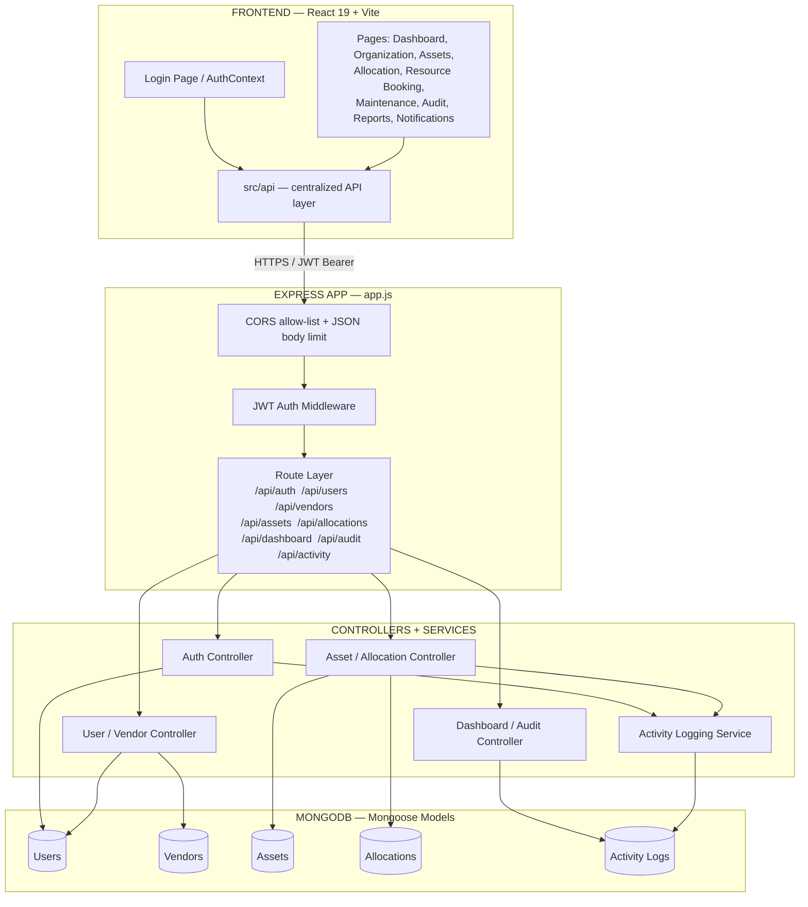

<div align="center">

<!-- Animated capsule banner -->


<!-- Animated typing subtitle -->
<a href="#">
  
</a>

<br/>

<!-- Badges -->


</div>

<br/>


## Table of Contents

- [Overview](#overview)
- [Feature Highlights](#feature-highlights)
- [What Changed in This Pass](#what-changed-in-this-pass)
- [Tech Stack](#tech-stack)
- [System Architecture](#system-architecture)
- [Getting Started](#getting-started)
- [Environment Variables](#environment-variables)
- [Project Structure](#project-structure)
- [Production Notes](#production-notes--still-todo-before-a-real-launch)
- [Contributing](#contributing)
- [License](#license)


## Overview

**AssetFlow** is a full-stack ERP module for tracking organizational assets from
registration through retirement — allocation to employees, resource booking,
maintenance scheduling, audits, and reporting — all wrapped in one clean
dashboard.

<div align="center">

<br/>
<sub>Replace this GIF with a real screen recording of your dashboard once deployed</sub>
</div>

## Feature Highlights

<table>
<tr>
<td width="50%" valign="top">

### Auth & Access
- JWT-based authentication (7-day access token)
- Role-aware routing (Admin / Employee)
- Seeded admin account for instant first login

### Organization & Assets
- Full asset registry with image + document uploads
- Vendor management
- Allocation & return tracking with live activity logs

</td>
<td width="50%" valign="top">

### Booking & Maintenance
- Resource booking calendar
- Maintenance scheduling & history
- Audit trails for compliance

### Dashboard & Reports
- Live activity feed (login, create, allocate, return)
- Chart.js-powered analytics
- Notifications wired to real backend events

</td>
</tr>
</table>

## What Changed in This Pass

> This pass took the backend from ~50% stubbed to a **complete REST API**
> and connected the frontend to real data end-to-end.

| Area | Change |
|---|---|
| **Backend Controllers/Routes** | Filled in previously-empty **User, Vendor, Dashboard, Audit,** and **Activity** modules — API now complete for every schema-defined module |
| **Activity Logging** | New logging service wired into login, asset creation, and allocation/return — powers real Notifications & Dashboard feeds |
| **CSS Fix** | Fixed invisible PrimeReact button labels (`.p-button` had a black background with no explicit text color) |
| **App Hardening** | Added CORS origin allow-listing, a 5MB JSON body limit, and a 404 handler to `app.js` |
| **Frontend API Layer** | Built `src/api/` and `AuthContext`; rewired **every page** (Login, Dashboard, Organization, Assets, Allocation, Resource Booking, Maintenance, Audit, Reports, Notifications) from static mocks to live backend calls |
| **Dev Setup** | Added `backend/.env` with random dev-only secrets + `backend/scripts/seed.js` for an initial Admin user |

## Tech Stack

<div align="center">

| Layer | Technology |
|:---:|:---|
| **Frontend** | React 19 · Vite · Tailwind CSS v4 · PrimeReact · Chart.js |
| **Backend** | Node.js · Express 5 · JWT Auth |
| **Database** | MongoDB · Mongoose |
| **Storage** | Local `backend/uploads` (S3-ready for production) |

</div>

## System Architecture

The diagram below shows how a request moves from the browser through the API
layer, into the Express controllers, and down to MongoDB — with the activity
logging service tapping in on every write operation.




## Getting Started

### 1. Backend

```bash
cd backend
npm install

# .env is already populated with a random JWT secret.
# Update MONGODB_URI to point at your MongoDB instance (Atlas or local).

npm run seed   # creates an Admin login: admin@assetflow.com / Admin@12345
npm run dev    # -> http://localhost:5001
```

### 2. Frontend

```bash
cd frontend
npm install

# .env already points VITE_API_URL at http://localhost:5001/api

npm run dev    # -> http://localhost:5173
```

<div align="center">

Sign in with the seeded admin account, or use **"Create account"** to register a new Employee.

</div>

## Environment Variables

<details>
<summary><b>backend/.env</b> (click to expand)</summary>

```env
PORT=5001
MONGODB_URI=your-mongodb-connection-string
JWT_SECRET=replace-before-deploying
CLIENT_URL=http://localhost:5173
```

</details>

<details>
<summary><b>frontend/.env</b> (click to expand)</summary>

```env
VITE_API_URL=http://localhost:5001/api
```

</details>

## Project Structure

```text
AssetFlow/
│
├── backend/
│   ├── controllers/
│   │   ├── auth.controller.js
│   │   ├── user.controller.js
│   │   ├── vendor.controller.js
│   │   ├── asset.controller.js
│   │   ├── allocation.controller.js
│   │   ├── dashboard.controller.js
│   │   ├── audit.controller.js
│   │   └── activity.controller.js
│   │
│   ├── routes/
│   │   ├── auth.routes.js
│   │   ├── user.routes.js
│   │   ├── vendor.routes.js
│   │   ├── asset.routes.js
│   │   ├── allocation.routes.js
│   │   ├── dashboard.routes.js
│   │   ├── audit.routes.js
│   │   └── activity.routes.js
│   │
│   ├── models/
│   │   ├── User.js
│   │   ├── Vendor.js
│   │   ├── Asset.js
│   │   ├── Allocation.js
│   │   └── ActivityLog.js
│   │
│   ├── services/
│   │   └── activityLogger.service.js
│   │
│   ├── middleware/
│   │   ├── auth.middleware.js
│   │   └── error.middleware.js
│   │
│   ├── scripts/
│   │   └── seed.js
│   │
│   ├── uploads/                  # asset images & documents
│   ├── .env
│   ├── package.json
│   └── app.js
│
└── frontend/
    ├── src/
    │   ├── api/                  # centralized API layer (axios instance + endpoints)
    │   │   ├── client.js
    │   │   ├── auth.api.js
    │   │   ├── assets.api.js
    │   │   └── dashboard.api.js
    │   │
    │   ├── context/
    │   │   └── AuthContext.jsx
    │   │
    │   ├── pages/
    │   │   ├── Login.jsx
    │   │   ├── Dashboard.jsx
    │   │   ├── Organization.jsx
    │   │   ├── Assets.jsx
    │   │   ├── Allocation.jsx
    │   │   ├── ResourceBooking.jsx
    │   │   ├── Maintenance.jsx
    │   │   ├── Audit.jsx
    │   │   ├── Reports.jsx
    │   │   └── Notifications.jsx
    │   │
    │   ├── components/
    │   ├── index.css              # Tailwind + PrimeReact overrides
    │   └── main.jsx
    │
    ├── .env
    ├── package.json
    └── vite.config.js
```

## Production Notes — Still TODO Before a Real Launch

- [ ] Regenerate `JWT_SECRET` and set a real `MONGODB_URI` — never commit `.env`
- [ ] Put the API behind HTTPS and set `CLIENT_URL` to your real frontend origin
- [ ] Add rate limiting (e.g. `express-rate-limit`) to `/api/auth/login`
- [ ] Add server-side pagination to list endpoints once data volume grows
- [ ] Move asset images/documents to object storage (e.g. S3) before scaling
- [ ] Consider refresh tokens — current JWT is a single 7-day access token

## Contributing

Contributions, issues, and feature requests are welcome.
Feel free to check the [issues page](../../issues) or open a pull request.

## License

Distributed under the **MIT License**. See `LICENSE` for more information.

<div align="center">


<sub>AssetFlow &copy; 2026</sub>

</div>
